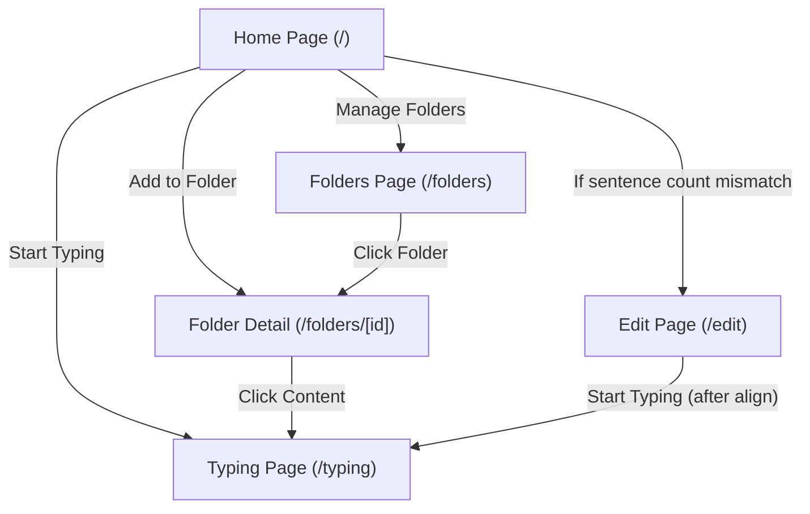

# Simple Typing App Navigation Map (2025-06-29)

- Home: main entry, translation, typing, add to folder, manage folders
- Typing: sentence-by-sentence typing
- Sentence Alignment: edit/align sentences if counts mismatch
- Folders: manage folders, create/open
- Folder Detail: view, delete, or start typing with content

> This file is for documentation only and will not affect your app implementation.
